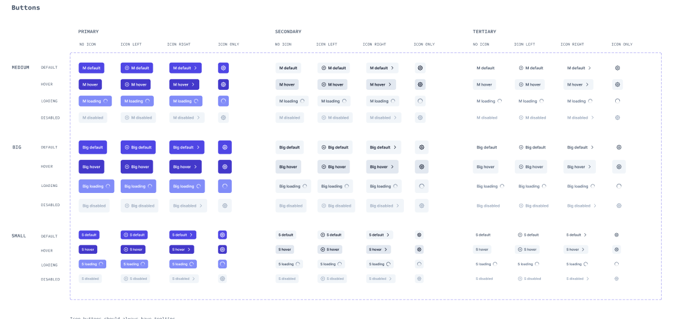

# pangman-ui

Welcome to the **UI Library**, a prototype designed for learners to understand the **fundamental structure** of UI design and best practices for structuring and organizing UI components. This library serves as an example of how to **build a scalable UI library** using **TypeScript**, **React**, and **Vite**.

### Table of Contents

1. **Purpose**

   - [Overview and Learning Objectives](#purpose)

2. **Design System**

   - [Figma Design System](#design-system)

3. **Installation and Usage**

   - [Installation Guide](#installation)

4. **Components**

   - [List of Components](#components)
   - In `lib/content/docs`

5. **Project Setup**

   - [Install and Run Document](#project-setup)

6. **Tailwind CSS Optimization**

   - [Install Dependencies](#optimize-tailwind-css)
   - [Configure Tailwind and PostCSS](#optimize-tailwind-css)
   - [Update Vite Configuration](#optimize-tailwind-css)
   - [Import Tailwind in CSS](#optimize-tailwind-css)
   - [Optimize for Production](#optimize-tailwind-css)
   - [Minify and Bundle](#optimize-tailwind-css)
   - [Analyze Final Build](#optimize-tailwind-css)

7. **Additional Recommendations**

   - [Best Practices for Building a UI Library](#additional-recommendations-for-building-a-good-ui-library)

---

## Purpose

This project is not just a set of reusable UI components, but also a **learning tool** aimed at helping developers:

- Understand **best practices** in structuring UI libraries.
- Learn how to effectively use **TypeScript** with React and Vite.
- Create a **foundation** for building their own scalable, reusable UI component libraries.

By studying this library, learners can gain insight into the organization and structure that facilitates easy maintenance, scaling, and collaboration in large projects.

---

## Design system

###

<div align="center">
  
  
  <!-- <iframe style="border: 1px solid rgba(0, 0, 0, 0.1);" width="800" height="450" src="https://embed.figma.com/design//yVLJLnreOFixR5EbOIt2zH/Design-System?node-id=2402-4625&embed-host=share" allowfullscreen></iframe> -->
</div>

###

- [Preview Figma Design](https://embed.figma.com/design/yVLJLnreOFixR5EbOIt2zH/Design-System?node-id=2402-4625&embed-host=share)
- The Figma UI Kit is open sourced by [Irina Nik](https://www.figma.com/community/file/1131891137727824106/free-accessible-design-system).
- [View more](<https://www.figma.com/design/yVLJLnreOFixR5EbOIt2zH/Free-Accessible-Design-System-(Community)?node-id=1406-1723&m=dev&t=grzyJnuaJGI9wsep-1>) For sample best practive.

---

## Features

- **Educational Prototype**: Learn the basic structure of designing reusable UI components.
- **Best Practices**: Follow best practices in organizing and structuring your project for scalability and reusability.
- **TypeScript, React, and Vite**: Understand how to combine these technologies to build a modern UI library.
- **Customizable & Accessible**: Components are designed to be flexible, responsive, and accessible by default.

## Installation and Usage

install ui libray

```bash
# Using npm
npm install pangman-ui
```

usage:

###

```tsx
import React from 'react';
import { Button } from 'pangman-ui';

const App = () => {
  return (
    <div>
      <Button variant="primary" onClick={() => alert('Button Clicked!')}>
        Click Me
      </Button>
    </div>
  );
};

export default App;
```

## Components

| Component    | Description                                                                                                                        |
| ------------ | ---------------------------------------------------------------------------------------------------------------------------------- |
| `Button`     | A versatile button with multiple variants.                                                                                         |
| `Input`      | A customizable input field with support for validation.                                                                            |
| `Textarea`   | A multi-line input field that allows users to enter longer text, useful for comments, descriptions, or notes.                      |
| `PhoneInput` | An input field specifically designed for phone number entry, with validation and format handling based on different country codes. |
| `Password`   | A password input field with integrated strength meter and feedback, offering better security awareness during password creation.   |

---

## Project Setup

#### 1. Clone the repository:

```bash
git clone https://github.com/Nattha-KT/ui-design-system.git
```

#### 2. Navigate to the project directory:

```bash
cd ui-design-syste
```

#### 3. Install dependencies:

This project uses **Vite**, **React**, **TypeScript**. To install all the necessary dependencies, run:

```bash
npm install
```

#### 4. Run documentation with storybook:

```bash
npm run storybook
```

---

## Optimize Tailwind CSS

To use **PostCSS** with **Tailwind CSS** in an optimized way in your Vite + React project, follow these steps:

### 1. **Install Dependencies**

Ensure that you have the necessary dependencies installed for **Tailwind CSS** and **PostCSS**:

```bash
npm install tailwindcss postcss autoprefixer cssnano
```

### 2. **Configure Tailwind and PostCSS**

Create the configuration files for **Tailwind CSS** and **PostCSS**.

#### **PostCSS Configuration**

Create a `postcss.config.js` file in the root of your project. This file tells **PostCSS** how to process your styles:

```js
module.exports = {
  plugins: {
    tailwindcss: {},
    autoprefixer: {}, // Adds vendor prefixes automatically
  },
};
```

#### **Tailwind Configuration**

If you don't already have a `tailwind.config.js` file, you can generate one with the following command:

```bash
npx tailwindcss init
```

In your `tailwind.config.js` file, configure the purge options for removing unused CSS during production builds:

```js
module.exports = {
  mode: 'jit', // Enable Just-in-Time (JIT) mode for faster builds and smaller final output
  purge: ['./src/**/*.{js,jsx,ts,tsx}', './public/index.html'], // Paths to files to scan for used CSS classes
  darkMode: false, // or 'media' or 'class'
  theme: {
    extend: {},
  },
  variants: {
    extend: {},
  },
  plugins: [],
};
```

`Note` You can learn more in Tailwind Document : [Optimizeing for Production](https://tailwindcss.com/docs/optimizing-for-production)

### 3. **Update Vite Configuration**

Modify your `vite.config.js` file to ensure that **PostCSS** is correctly applied. Since **Vite** has built-in support for **PostCSS**, you don't need to do much here:

```js
import { defineConfig } from 'vite';
import react from '@vitejs/plugin-react-swc';
import path from 'path';

export default defineConfig({
  plugins: [react()],
  css: {
    postcss: './postcss.config.js', // Point to your PostCSS config file
  },
  resolve: {
    alias: {
      '@': path.resolve(__dirname, './src'),
      '@styles': path.resolve(__dirname, 'src/styles'),
    },
  },
});
```

### 4. **Import Tailwind in Your CSS**

In your main CSS or SCSS file (e.g., `src/index.css` or `src/styles/main.scss`), import the core **Tailwind CSS** styles:

```css
@tailwind base;
@tailwind components;
@tailwind utilities;
```

This ensures that all **Tailwind CSS** base styles, components, and utilities are available in your project.

### 5. **Optimize CSS for Production**

During production builds, **Tailwind CSS** automatically purges unused styles from your final CSS bundle. You don’t need to configure additional plugins like **PurgeCSS** because **Tailwind's JIT mode** will ensure that only the used CSS is included.

For best optimization, ensure you run the **production build** using:

```bash
npm run build
```

Vite will:

- Minimize your CSS and JS bundles.
- Purge unused Tailwind classes (if configured correctly with `purge` paths).
- Use **PostCSS** to add vendor prefixes via **Autoprefixer**.

### 6. **Minify and Bundle Tailwind (Optional)**

If you'd like to further optimize your build, Vite already handles CSS minification by default. You can additionally configure **CSS splitting** if needed:

```js
export default defineConfig({
  build: {
    cssCodeSplit: true, // Ensures CSS is split for better performance
    minify: 'terser', // Terser is used to minimize JS and CSS
  },
});
```

### 7. **Analyze the Final Build (Optional)**

To verify that **PostCSS** and **Tailwind** are optimized in the final build, use a build analyzer. This can give you insights into your bundle size:

1. Install the build analyzer plugin:

   ```bash
   npm install rollup-plugin-visualizer --save-dev
   ```

2. Add the analyzer to your `vite.config.js`:

   ```js
   import { visualizer } from 'rollup-plugin-visualizer';

   export default defineConfig({
     plugins: [react(), visualizer()],
   });
   ```

3. Run the production build and analyze:
   ```bash
   npm run build
   ```

This will generate a report that shows you which parts of the **CSS** and **JS** are contributing the most to your bundle size.

---

## Additional Recommendations for Building a Good UI Library

When building a UI library, especially for large-scale applications, there are several practices and tools that can help improve maintainability and scalability:

### 1. **Monorepo Structure**

Using a **monorepo** approach can help manage multiple packages (e.g., components, themes, utilities) within a single repository. Tools like **Nx** or **Lerna** make it easy to structure and manage your monorepo, offering benefits such as:

- Centralized management of dependencies.
- Easier refactoring across multiple packages.
- Consistent versioning and publishing workflows.

### 2. **Component Documentation**

Make sure to document each component thoroughly. Tools like **Storybook** allow you to create a visual representation of your components, making it easier for others to understand and use your library.

### 3. **Automated Testing**

Including **unit tests** for each component ensures that they work as expected. Testing frameworks like **Jest** or **Vitest** and **React Testing Library** are useful for verifying component behavior.

### 4. **CI/CD Integration**

Setting up continuous integration (CI) and continuous delivery (CD) pipelines can automate testing, building, and publishing your library. Tools like **GitHub Actions** or **CircleCI** can help automate these processes, ensuring that your library is always ready for production.

### 5. **Versioning and Changelog**

Use a versioning strategy like **semantic versioning** (SemVer) to keep track of changes in your library. Also, maintain a **changelog** to document important updates and improvements, helping users understand what has changed between releases.

### 6. **Tree Shaking**

Tree shaking removes unused code, making your library lighter. Ensure your components are exported as **ES modules** to enable this.

```ts
// Import only Button
import { Button } from '@your-library-name/ui-library';
```

### 7. **Separate Entry Points**

Provide separate entry files for individual components, allowing developers to import only what they need.

```ts
// Import only the Button component
import Button from '@your-library-name/ui-library/button';
```

### 8. **Code Splitting**

Break large components into smaller bundles that load only when needed, improving performance.

```ts
const Modal = React.lazy(() => import('@your-library-name/ui-library/modal'));

<Suspense fallback={<div>Loading...</div>}>
  <Modal />
</Suspense>;
```

### 9. **Dynamic Import**

Use dynamic imports to load components asynchronously, further enhancing performance.

```ts
const Chart = React.lazy(() => import('@your-library-name/ui-library/chart'));
```

These practices—Tree Shaking, Separate Entry Points, Code Splitting, and Dynamic Import—will help keep your library efficient and optimized.

---

## License

This project is licensed under the [MIT License](./LICENSE).
It also incorporates third-party libraries that are licensed under their respective terms:

- shadcn-phone-input (MIT License)
